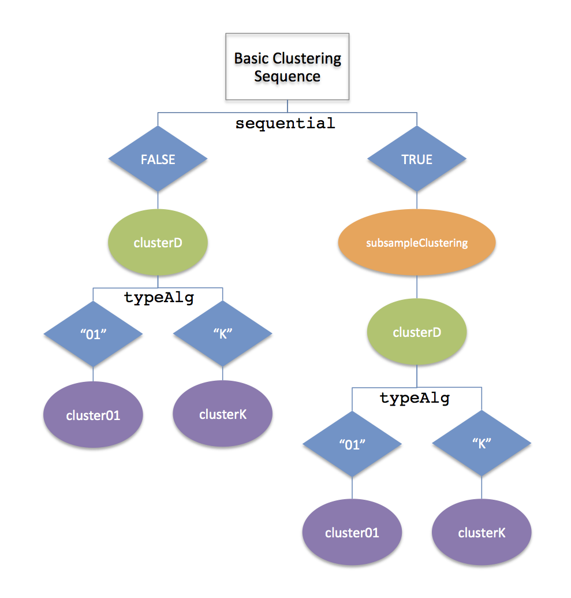

The goal of this package is to allow the user to try many different clustering algorithms in one package structure. In particular, the package encodes many common practices that are shared across clustering algorithms, like subsampling the data, not clustering samples with negative silhouete scores, sequentially removing clusters and reclustering, and so forth, and allows the user to simply make different choices the parameters as well as the underlying clustering algorithm. The package also allows the user to define their own clustering algorithm. 

There are two main user-functions, `clusterAll` and `compareChoices`. `clusterAll` is the wrapper function that calls the underlying functions and `compareChoices` runs `clusterAll` across combinations of parameter choices.  


There are three main choices that the user needs to make:

* Whether to run a sequential strategy (`sequential`) which finds the best cluster, removes those samples, and then starts the clustering again.
* Whether to cluster the co-occurence matrix created by subsampling the data, clustering the subsampled data, and average the number of times the samples are co-clustered (`subsample`). Otherwise `dist(x)` is clustered.
* What clustering algorithm to use (`clusterFunction`)

Arguments to the underlying functions are passed to `clusterAll` as lists of arguments. 


# Basic Clustering Functions

There are two basic parts of the clustering routine. `clusterD` is the basic function that clusters an input $n x n$ dissimilarity matrix $D$ based on the `clusterFunction` option given by the user (which can be either a character string of pre-detemined options or a user-defined functions). There are two flavors of `clusterD` depending on the nature of the dissimilarity matrix $D$, and thus `clusterD` can call two different functions `cluster01` and `clusterK` to do the clustering using the clustering algorithm provided by `clusterFunction`. 

`cluster01` is intended for clustering algorithms that assume the elements of the input matrix $D$ are in $[0,1]$ and use the value of the elements of $D$ to determine the clusters (i.e. don't require an imput $K$ defining the number of clusters). The use case here is when $D$ is given based on subsampling the samples and clustering them and creating a co-occurence matrix. Built-in options include 'tight' and 'hierarchical' both of which search for indices of samples $\mathcal{I}$ of samples for which the submatrix $D[\mathcal{I},\mathcal{I}]$ has values close to $1$ in order to determine a cluster. In this way, instead of requiring the number of clusters, there is a tuning parameter $\alpha\in(0,1)$ which determines if the $D[\mathcal{I},\mathcal{I}]$ values are sufficiently close to $1$. 

`clusterK` is intended for algorithms that expect the user to give a value $K$ giving the number of clusters. This function then includes options appropriate for such algorithms, such as searching over a range of values $K$ and returning the 'best' cluster, or removing samples with low 'silhouette' values. 

The following image shows how these clustering functions are put together by `clusterAll`
```{r flowspreadSheet2, echo = F, results = 'asis'}
cat('\n\n')
```


# Sequential option
```{r flowspreadSheet1, echo = F, results = 'asis'}
cat('\n\n')
```


